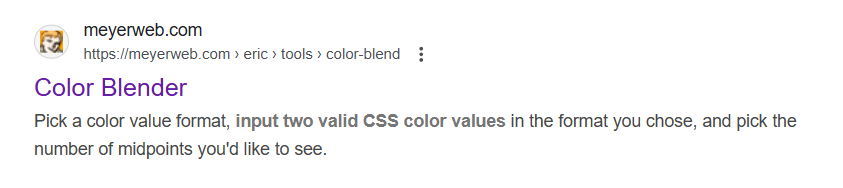
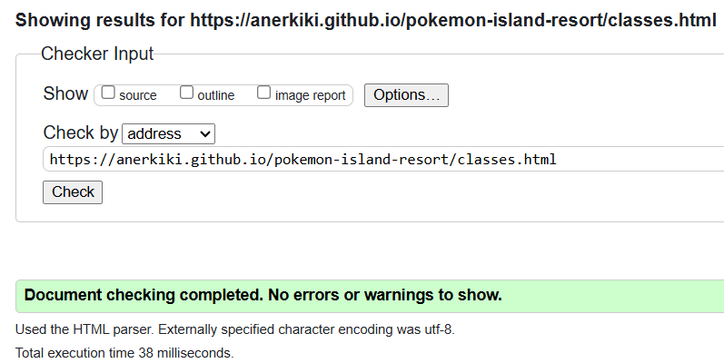

# Pokemon Island Resort

## Introduction

I am looking to create this website to showcase an island resort for pokemon and trainers and allow customers to book rooms and excursions.

# Credits

Background Photo:
https://www.freepik.com/free-vector/tropical-summer-design_4413927.htm#fromView=search&page=1&position=20&uuid=908ffdb2-32b3-4b07-85ec-33b39605b911&query=beach

Bamboo background photo:
https://www.freepik.com/free-photo/bamboo-patterned-curtain-textured-backdrop_15653469.htm#fromView=search&page=3&position=10&uuid=454e2832-7423-4416-8494-fd1cb49161d4&query=bamboo

Favicon:
https://www.iconarchive.com/show/noto-emoji-animals-nature-icons-by-google/22331-palm-tree-icon.html
apache open <source>

Hero Image:
https://www.redbull.com/au-en/new-game-releases-november-2016
https://img.redbull.com/images/c_crop,x_0,y_0,h_1498,w_2999/c_fill,w_1700,h_765/q_auto,f_jpg/redbullcom/2016/10/31/1331826758607_2/scene-from-the-new-pok%C3%A9mon-sun-and-moon-game-for-nintendo-ds3

**ColorZilla - Chrome Extension** - for finding colour codes from colours on websites.

**Color Blender** - I used this website to find a colour between my main and highlight colours using their hex codes:

https://meyerweb.com/eric/tools/color-blend/#:::hex
https://meyerweb.com/eric/tools/color-blend/#FFD8B7:FEEDDC:5:hex