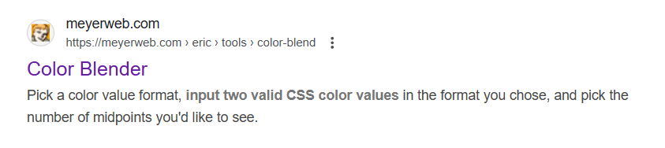
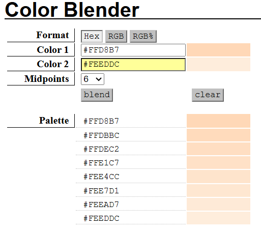
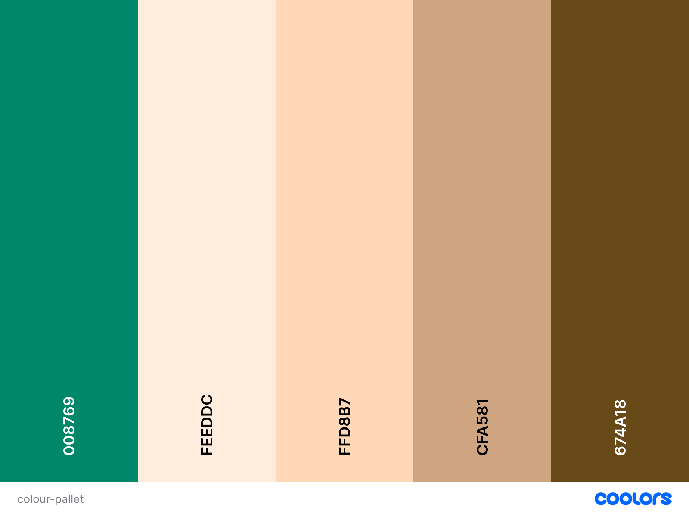
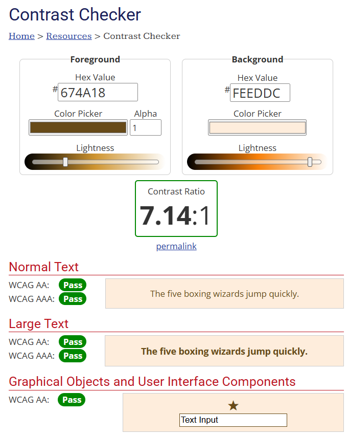
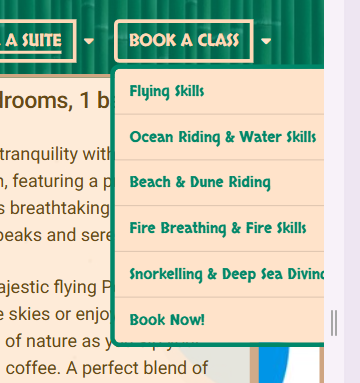
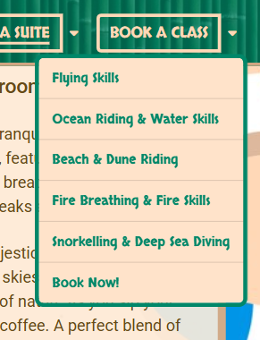
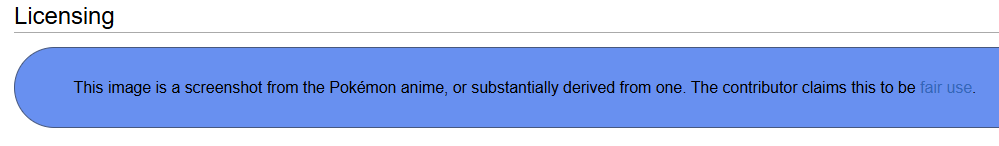

---

# Pokemon Island Resort

---

## Introduction

---

I am looking to create this website to showcase a fictional tropical island resort designed for Pokémon and their trainers.

The goal is to create a visually engaging and appealing platform that captures the essence of a tropical getaway for Pokemon and Pokémon enthusiasts, which allows customers to get a feel for the resort, viewing the various activities the island has to offer, seeing and learning about the trainers, and booking suites/enrolling their Pokémon in classes.

View live website [here](https://anerkiki.github.io/pokemon-island-resort/) (Hosted on GitHub pages)

# Table of Contents

- [Introduction](#introduction)
- [Technologies Used](#technologies-used)
  - [Frameworks, Programs, and Libraries](#frameworks-programs-and-libraries)
- [Features](#features)
  - [Key Features](#key-features)
  - [Site Wide Features](#site-wide-features)
  - [Pages](#pages)
- [Design and Planning](#design-and-planning)
  - [User Experience/User Interface(UX/UI)](#user-experienceuser-interfaceuxui)
  - [Design and Brand Identity](#design-and-brand-identity)
  - [Wireframes](#wireframes)
  - [Typography](#typography)
  - [Colour Scheme](#colour-scheme)
- [Testing](#testing)
- [Bugs](#bugs)
- [Deployment](#deployment)
- [Credits](#credits)
- [Other](#other)

---

# Technologies Used

---

### Frameworks, Programs, and Libraries

- [GitHub](link):
  - GitHub has been used to store this project.
- [Google Fonts](link):
  - I used this to find and create an import url so that I could use by 2 chosen fonts in the project.
- [VScode](link):
  - I used this as my IDE to code and develop this website and to push to GitHub.

#### **Color Tools**:

- [ColorZilla - Chrome Extension](https://www.colorzilla.com/)
  - I used this to pinpoint exact colour codes from images etc on websites.

- [Color Blender](https://meyerweb.com/eric/tools/color-blend/#:::hex)
  - I used this website to find a colour between my background and highlight colours using their hex codes.
<!-- add this to the design and planning colour pallet section -->

https://meyerweb.com/eric/tools/color-blend/#:::hex

https://meyerweb.com/eric/tools/color-blend/#FFD8B7:FEEDDC:5:hex

---

## Features

---

### Key Features

- **Fully Responsive at any screen size:** This includes a hero image that switches from landscape to portrait at mobile and tablet view, and text 'bubbles' that change order and location trainsitioning from different screen sizes, such as from mobile to laptop, and images which go from being inside the floating text bubbles, to outside, next to the text, in their own "bubbles".

---

### Site Wide Features

#### Favicon

#### Navbar:
This has links to all of the main pages and is always fixed to the top, so is accessible from anywhere in the website. It has links to all of the pages (with exception to the Success/Thank You page - which you access after submitting any of the forms) - [see full list](#full-navbar-button-dropdown-list)

Below is an interactive feature to show you the buttons in the navbar and dropdown options of each (tap the arrow to see dropdown options):

Home

  - Our Activities 
  - Our Trainers 
  - Message Us  

 

Trainers

- Trainer Kiawe 
- Trainer Mallow 
- Trainer Lana 

 

Contact

- Send Us a Message 
- Book a Class 
- Book a Suite 
- Social Media 

 

Book a Suite

- Luxury Sea View Penthouse 
- Mountain View Apartment 
- Garden View Chalet 
- Arena View Apartment 
- Book Now! 

 

Book a Class

- Flying Skills 
- Ocean Riding & Water Skills 
- Beach & Dune Riding 
- Fire Breathing & Fire Skills 
- Snorkeling & Deep Sea Diving 
- Book Now! 

#### Footer:

This has links to social media, and is shown at the bottom of each page, although not fixed in place like the **Navbar** is

---

### Pages
***Note:*** *Pages/sections marked with **\*** can be accessed through the navbar buttons or their dropdown menu options*

- **Home Page*** featuring:
  - A fun and colourful **Hero Image** with small 'Welcome' text bubble.
  - An **Activities** Section* with responsive "floating" text bubbles and images which multiply to up to 3, or appear inside the text boxes/bubbles at different screen sizes.
  - An **Our Trainers** Section* with group image, and then individual images, descriptions, and links to their classes, which are fully responsive, and the images also multiply to up to 3, or appear inside the text boxes/bubbles at different screen sizes.*
  - A **Contact Form*** to get in touch, with an adjustable message box, which links to the **Success/Thank You Page** when correctly submitted.

- **Suites Page*** featuring:
  - A large bubble **Page Title** which disappears and is instead incorporated into the navbar on smaller (mobile) devices.
  - **4 Suite Options*** with images, descriptions, [[[links to nearby activities??]]] and a 'Book Now' button, which links directly down to the Booking Form at the bottom of the page.
  - A Suite **Booking Form*** with dropdown menu to pick a suite to enquire about, which link to the **Success/Thank You Page** when correctly submitted.

- **Classes Page*** featuring:
  - **5 Class Options*** which are all fully responsive, so the image is inside the description box in a mobile/tablet screen, and then on larger screens the images pop out of the text box and appear beside, increasing/decreasing from 1 to 4 depending on the screen size, to match the height of the description bubble. As well as related images, these all have titles, descriptions, which trainer/trainers that will take the class (including a link to the specific trainer on the main home page), and a 'Book Now' button, which links directly down to the Booking Form at the bottom of the page.
  - A Class **Booking Form*** with dropdown menu to pick a suite to enquire about, which link to the **Success/Thank You Page** when correctly submitted.

- **Success/Thank You Page** feauturing:
  - A large bubble **Page Title** saying 'Thank You' which disappears and is instead incorporated into the navbar on smaller (mobile) devices.
  - A message of gratitude to the customer, including links to other places on the website that they can look at.
  - An image of all of the 

---

## Design and Planning

---

**Design and Brand Identity**

The website is designed to have a fun, playful feel, and get potential visitors excited about everything the island has to offer.

Text bubbles, partially transparent with curved coloured chunky borders, and (at larger screen sizes) images with large chunky borders. These jump from left to right as you go down the page, a playful and quirky feel.

Lots of colour and images 

---

### User Experience/User Interface(UX/UI)

A typical customer will be:
- A pokemon owner
- Someone that likes to travel/try new things
- Young and up for adventure

#### User Stories

"As a past visitor to the resort I want to be able to show my friends and family an overview of what the resort has to offer, trianers I've met and experiences I've taken."

"As a new visitor to the site I want to see if the island will have everything I'm looking for and feel comfortable that I will enjoy my stay."

"As a new visitor to the site I want an easily navigatable site layout."

"As a vistor the site looking to contact the resort/book a class or suite, I need to feel confident that my message/request has been received."

---

### Wireframes

---

### Typography

**Fonts**

I wanted to pick a seaside-y/tropical/playful font for my headings etc, and I used **Google Fonts** to find one. I used their tool where you can write a specific phrase - in my case it was 'Pokémon Island Resort', as I knew this would be the main writing at the top of the page, so would be the most important to look right. I compared this title in many different fonts, especially what the (é) looks like, as it did look strange on a few of them, but I decided on 'Skranji' - as I feel exactly it has the exact exotic, tropical and beachy feel I wanted, and even reminded me slightly of bamboo used on island huts etc.

To pair with this, for a paragraph font, I wanted a simple, clear and unfussy font, that would compliment the heading font 'Skranji' without competing for attention, and again used **Google Fonts** to look through their sans-serif options and see what would work nicely. I chose 'Roboto', as it is a versatile and widely used sans-serif font designed for readability and legibility across different devices and screen sizes, balancing geometric shapes with open curves.

---

### Colour Scheme

**Background**
I wanted a sandy/beach/island feel for the website, so was thinking of a background in either a sand colour or a blue sea colour.

I liked the idea of having a background image, so decided to start by browsing through [link] to see if there was anything that could work. I decided this [background image](#background-photo) was right fit for my project and aesthetic as soon as I saw it. I instantly loved the colours from it and decided to pick the colours for the rest of the website from different parts of the image, as the colours were lovely and worked well together.

I did this using a Chrome extension called **ColorZilla** (add link to below?), which allowed me to use a dropper tool anywhere on the webpage, and told me the colour code of it. I did this with various colours, and then narrowed the choices down after viewing them on the webpage.

I saved each colour using `var(--colour-name)` so that if I decided to I wanted to change any of the colours at a later date, I could just do it from 1 place rather than having to amend each individually. This did come in handy when I tested my secondary (paragraph) font colour against the background colour I chose for the text bubbles [link to contrast testing section]

**Header (including navbar) and Footer**

For the Header and Footer of the site, I decided I wanted it to have a bit of a bamboo shack feel, so started looking for images with horizontally lined up bamboo. Eventually found an image (link to bamboo image) I was happy with, but the colouring was wrong, so I decided to use an an partly overlay of one of the colours I'd decided on using before from the leaves the background image.

I decided to use this too for the footer, as it gave the site a bit more of a 'beach shack' type feel, and looked nice and dark enough for lighter content to show up well. 

**Font Colouring**

The only colour that wasn't from the background was the dark brown I chose for the paragraph text, as the rest of the colours were a bit light against the pale background apart from the leaf colour, but I was already planning to use this only on the header/footer, and some of the headings to make them pop, so it wasn't an option for the main bodies of text/description text colour.

I chose a dark brown, so that it doesn't clash or compete for attention from any of the more important headers, that I want the attention to initially be drawn to.

For this reason I kept the headings (Skranji) as more colourful, in a brighter green/golden sandy colour depending on the background shade, e.g. the bolder leaf colour on a paler background and the lighter sand colour on a darker background, so that the contrast is enough to be read easily.

I tested the colors using [wave link] [contrast test link], and amended the colours slightly later on so that I would pass tests that I'd failed with the previous colour. [this is mentioned here](link to #testing / #contrast#test)

---

## Testing

### Lighthouse Performance
  - Laptop & Mobile?

### WAVE Test

### WebAIM Contrast Checker
[WebAIM Contrast Checker](https://webaim.org/resources/contrastchecker/)

Original Colour Pallet:

<!-- Add here screenshot of old pallet not passing AAA test -->

### W3C Markup Validation Service (HTML and readme?)

### W3C CSS Validation Service

### Manual Testing (Expected Outcome/Did it pass?)
  - Navigation Links
  *What I'm testing:*
  Do all links navigate to the correct page/section?
  Do all buttons lead to the intended destination?
  - Forms
  *What I'm testing:*
  Does all the validation work, so the form can't be submitted without all required fields filled and with valid/the correct characters?
  Once submktted does it navigate to the success.html page?
  - External Links (Social Media Icons)
  Do they all lead to the intended website?
  Do they open in a new tab?
  - Responsive Design
  Does the website adapt as intended at all screen sizes?
  Does the burger menu work as it should, including closing when a link has been clicked?

### Manual Testing user stories

---

## Bugs

### Issues I Fixed

Dropdown Menu being cut off

**Issue:**
When the right dropdown menu is opened, some of the menu text is cut off by the edge of the screen. This happens because the dropdown button is positioned close to the screen edge, and the menu options are too long to fit within the visible area.

**Why:**
Bootstrap dropdown menus are left-aligned by default. If the dropdown is near the right edge of the screen and the menu options are long, the menu will overflow and appear clipped, making some text not fully visible.

**Solution:**
By reading the documentation about Bootstrap dropdown menus, I found a fix to change the alignment of a menu to right-aligned instead, by simply adding the class `dropdown-menu-end` to the same element with the `dropdown-menu` class. This right-aligns the dropdown menu, ensuring it stays within the visible area of the screen.

**Outcome:**

This has fixed the issue. I decided to change only the 2 right navbar dropdown button menus to right alignment, and kept the left side buttons as their default left alignment so that the dropdown menus are visually consistent and it also prevents any potential future overflow issues on the other side.

This solution resolved the problem. I chose to apply right alignment only to the two dropdown menus on the right side of the navbar, while keeping the left-side dropdowns left-aligned. This approach keeps the dropdown menus visually consistent and also helps prevent any future overflow issues on either side of the screen.

Later, I also updated the navbar alignment to better match the rest of the site's layout by changing `container-fluid` to `container` in the navbar, which added more space between the buttons and edges of the screen and helped the navbar appear more consistent with the more centered page content.

---

## Deployment

---

# Credits

---

## Site Wide

Icons from - Font Awesome
Fonts imported from - Google Fonts

---

## Images Used

### Home Page

#### **Freepik for page background image and Bamboo background used in Header and Footer**
##### Background Photo: 

*click here to view image*

[Freepik - Tropical Summer Design](https://www.freepik.com/free-vector/tropical-summer-design_4413927.htm)

##### Bamboo Image Used in Header and Footer:

*click here to view image*

[Freepik - Bamboo Patterned Curtain](https://www.freepik.com/free-photo/bamboo-patterned-curtain-textured-backdrop_15653469.htm)

#### **IconArchive for Favicon**
##### Favicon:

*click here to view image*

[IconArchive - Palm Tree Icon](https://www.iconarchive.com/show/noto-emoji-animals-nature-icons-by-google/22331-palm-tree-icon.html)
Favicon:
https://www.iconarchive.com/show/noto-emoji-animals-nature-icons-by-google/22331-palm-tree-icon.html
apache open source

- #### **Hero Image**: [RedBull - Pokemon Sun and Moon Game](https://www.redbull.com/au-en/new-game-releases-november-2016)
Hero Image:
https://www.redbull.com/au-en/new-game-releases-november-2016
https://img.redbull.com/images/c_crop,x_0,y_0,h_1498,w_2999/c_fill,w_1700,h_765/q_auto,f_jpg/redbullcom/2016/10/31/1331826758607_2/scene-from-the-new-pok%C3%A9mon-sun-and-moon-game-for-nintendo-ds3

Hero Image - Mobile:
https://www.google.com/imgres?imgurl=https%3A%2F%2Fwww.nintendo-difference.com%2Fwp-content%2Fuploads%2F2024%2F06%2FPokemon-GO-Fond-decran-Sous-un-meme-ciel.jpg&tbnid=yPOpOBrJxAe-BM&vet=12ahUKEwiV2IzlzfuMAxUMXkEAHeMkMK4QxiAoB3oECAAQJw..i&imgrefurl=https%3A%2F%2Fwww.nintendo-difference.com%2Fnews%2Fpokemon-go-le-debut-de-la-saison-sous-un-meme-ciel-et-les-evenements-de-juin-2024-detailles%2F&docid=d8prKse_oTl7ZM&w=1080&h=1920&itg=1&q=pokemon%20beach%20portrait&ved=2ahUKEwiV2IzlzfuMAxUMXkEAHeMkMK4QxiAoB3oECAAQJw

- **Garden View Chalet**  
    [Freepik - 3D Rendering Illustration Botanic Garden](https://www.freepik.com/free-ai-image/3d-rendering-illustration-botanic-garden_196493972.htm#fromView=search&page=2&position=39&uuid=52c17b35-c035-4347-baa9-c40592085e85&query=Garden+Wallpaper+anime)

Garden Suite Image:
Freepik -
https://www.freepik.com/free-ai-image/3d-rendering-illustration-botanic-garden_196493972.htm#fromView=search&page=2&position=39&uuid=52c17b35-c035-4347-baa9-c40592085e85&query=Garden+Wallpaper+anime

---
---

## Other

---

### Full Navbar Button Dropdown List

  - **Home** Button - which links to the home page
    - Dropdown Option 1 - **Our Activities**
    - Dropdown Option 2 - **Our Trainers**
    - Dropdown Option 3 - **Message Us**
  - **Trainers**
    - Dropdown Option 1 - **Trainer Kiawe**
    - Dropdown Option 2 - **Trainer Mallow**
    - Dropdown Option 3 - **Trainer Lana**
  - **Contact**
    - Dropdown Option 1 - **Send Us a Message**
    - Dropdown Option 2 - **Book a Class**
    - Dropdown Option 3 - **Book a Suite**
    - Dropdown Option 4 - **Social Media**
  - **Book a Suite**
    - Dropdown Option 1 - **Luxury Sea View Penthouse**
    - Dropdown Option 2 - **Mountain View Apartment**
    - Dropdown Option 3 - **Garden View Chalet**
    - Dropdown Option 4 - **Arena View Apartment**
    - Dropdown Option 5 - **Book Now!**
  - **Book a Class**
    - Dropdown Option 1 - **Flying Skills**
    - Dropdown Option 2 - **Ocean Riding & Water Skills**
    - Dropdown Option 3 - **Beach & Dune Riding**
    - Dropdown Option 4 - **Fire Breathing & Fire Skills**
    - Dropdown Option 5 - **Snorkeling & Deep Sea Diving**
    - Dropdown Option 6 - **Book Now!**

---

---

> [!NOTE]
> Useful information that users should know, even when skimming content.

> [!TIP]
> Helpful advice for doing things better or more easily.

> [!IMPORTANT]
> Key information users need to know to achieve their goal.

> [!WARNING]
> Urgent info that needs immediate user attention to avoid problems.

> [!CAUTION]
> Advises about risks or negative outcomes of certain actions.

<!-- Dropdown Template -->

Dropdown Template

Inner Hidden Content

