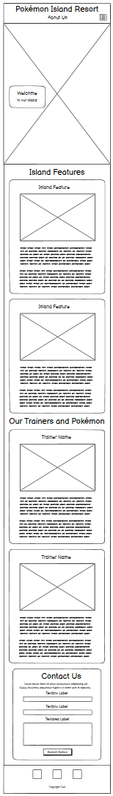

---

# Pokemon Island Resort


I am looking to create this website to showcase a fictional tropical island resort with classes and activities designed for Pokémon and their trainers.

The goal is to create a visually engaging and appealing platform that captures the essence of a tropical getaway for Pokémon and Pokémon enthusiasts, which allows customers to get a feel for the resort, viewing the various activities the island has to offer, seeing and learning about the trainers, and booking suites/enrolling their Pokémon in classes.

View live website [here](https://anerkiki.github.io/pokemon-island-resort/) (Hosted on GitHub pages)

---

# Table of Contents

- [Design and Planning](#design-and-planning)
  - [Objectives](#objectives)
  - [Design and Brand Identity](#design-and-brand-identity)
  - [User Experience/User Interface(UX/UI)](#user-experienceuser-interfaceuxui)
    - [Typical Customer Profile](#typical-customer-profile)
    - [User Stories](#user-stories)
  - [Wireframes](#wireframes)
  - [Typography/Fonts](#typographyfonts)
  - [Colour Scheme/Design](#colour-schemedesign)
    - [Background Images and Colours](#background-images-and-colours)
    - [Colour Pallet](#colour-pallet)
    - [Font Colouring](#font-colouring)
    - [Favicon](#favicon)

- [Features](#features)
  - [Key Features](#key-features)
  - [Site Wide Features](#site-wide-features)
    - [Navbar](#navbar)
    - [Footer](#footer)
    - [No Break Spaces](#no-break-spaces)
  - [Pages](#pages)

- [Testing](#testing)
  - [Lighthouse Performance](#lighthouse-performance)
  - [WAVE Test](#wave-test)
  - [WebAIM Contrast Checker Test](#webaim-contrast-checker-test)
  - [W3C Markup/HTML Validation Service](#w3c-markuphtml-validation-service)
  - [W3C CSS Validation Service](#w3c-css-validation-service)
  - [Manual Testing](#manual-testing)

- [Fixed Issues](#fixed-issues)
  - [Extra fixes for ease of use](#extra-fixes-for-ease-of-use)

- [Deployment](#deployment)

- [Credits](#credits)
  - [Technologies Used](#technologies-used)
  - [Images Used](#images-used)

- [Other](#other)
  - [Full Navbar Button Dropdown List](#full-navbar-button-dropdown-list)

---

# Design and Planning

---

## Objectives

The main objectives of the Pokémon Island Resort website are:

- **Showcase the Resort:** Present a vibrant, engaging overview of the fictional island resort, highlighting its unique features, activities, and accommodations for both Pokémon and their trainers.
- **Enhance User Engagement:** Create an interactive and visually appealing experience that encourages users to explore the site, learn about the trainers, and discover the variety of classes and suites available.
- **Facilitate Booking Requests and Enquiries:** Provide clear, accessible forms for users to enquire to book suites, enroll Pokémon in classes, or contact the resort, ensuring a smooth and user-friendly process.
- **Promote Accessibility and Responsiveness:** Ensure the website is fully responsive and accessible across all devices and screen sizes, offering an optimal experience for every visitor.
- **Build Trust and Credibility:** Use professional design, clear navigation, and transparent information to build user confidence in the resort and its offerings.

These objectives should guide the design, content, and functionality of the website to deliver a memorable and effective user experience.

---

## Design and Brand Identity

The website is designed to have a fun, playful feel, aiming to get potential visitors excited about everything the island has to offer. The overall aesthetic draws inspiration from tropical resorts and the vibrant world of Pokémon, using bright, cheerful colours and whimsical design elements throughout.

A key part of the design is the use of text bubbles - these are partially transparent with curved, chunky coloured borders that help them stand out against the background. On larger screens, images are also framed with the same thick, coloured borders, creating a cohesive look. The layout is intentionally dynamic: as you scroll down the page, the text bubbles and images alternate from left to right, giving the site a playful, quirky, and engaging flow that encourages exploration.

To further enhance the lively and playful atmosphere, I incorporated a variety of colourful images. These visuals not only make the site more visually appealing but also help communicate the resort's unique offerings and the sense of adventure awaiting visitors. The combination of bold typography, vibrant colour palette, and interactive elements (like dropdown menus and responsive layouts) ensures that the site feels welcoming and accessible to users of all ages, especially Pokémon fans and trainers looking for a fun getaway with their Pokémon.

Overall, every design choice - from the fonts and colours to the arrangement of content was made to capture the essence of a tropical Pokémon paradise, making the website both inviting and memorable.

---

## User Experience/User Interface(UX/UI)

### Typical Customer Profile

A typical customer for the Pokémon Island Resort is:

- A Pokémon owner or trainer
- Young and free spirited/eager for adventure
- Someone who enjoys travelling and exploring new destinations
- Enthusiastic about trying new and unique experiences and activities

### User Stories

- **As a new visitor:**
  - I want to quickly find out if the island has the activities and amenities I'm interested in, and feel assured that my stay will give me everything I'm looking for.

- **As a first-time user:**
  - I want the website to be easy to navigate, with a clear layout and intuitive links between pages, so I can move seamlessly through the site and find what I need without confusion and plan my trip effectively.
  
- **As a Pokémon trainer:**
  - I want to easily discover classes tailored to my Pokémon’s type and abilities, and find trainers with the right expertise to help them master their moves, develop new skills and reach their full potential.

- **As a guest or potential guest looking to contact or request to book:**
  - I want to feel assured that my message or booking request has been received and will be responded to.

- **As a past visitor:**
  - I want to easily share everything I have experienced at the resort with friends and family, including trainers I've met and activities/classes my Pokémon and I have taken part in.

---

## Wireframes

### Home Page
<details>
<summary>Click for wireframe images of Home Page</summary>

| Home Page on larger screens (laptops & larger): | Home Page on smaller screens (mobile & tablet): |
| :---: | :---: |
|  |  |
|  | *I removed some of the extra text bubbles that will be on <br>the finished website so that the image isn't too long* |
</details>

**Changes I made to this page**

I decided to change the 'Island Features' title to 'Our Activities' instead to be more exciting and engaging for potential customers. The term 'Island Features' felt a bit generic and didn't fully capture the fun, adventurous spirit I wanted to convey. By renaming it to 'Our Activities', the section immediately communicates that there are a variety of things to do at the resort, inviting visitors to imagine themselves taking part in these experiences.

I also changed the section title from 'Our Trainers and Pokémon' to just 'Our Trainers' to streamline the layout and make it more concise. Instead of listing both trainers and Pokémon together, I opted to highlight the trainers in the main section, and then specify which Pokémon are involved in each class within the relevant text bubbles.

I also decided to add a 'Contact Us' button to the left of the navbar menu, as thought this would be better to be more immediately visible for users of the website, and then decided to change the navbar menu button names so they were shorter and more concise (from 'About Us' to 'Home', 'Our Trainers' to 'Trainers' and 'Contact Us' to 'Contact'), taking less room and balancing better with the longer buttons on the right side 'Book a Room' and 'Book a Class'.

### Rooms (/Suites) Page
<details>
<summary>Click for wireframe images of Rooms Page</summary>

| Rooms Page on large screens (laptop & larger): | Rooms Page on smaller screens (mobile & tablet): |
| :---: | :---: |
|  |  |
</details>

**Changes I made to this page**

Later, I decided to change the name of this page from 'Rooms' to 'Suites', as I felt having apartments and chalets, etc. would give a more luxurious feel than simply having rooms to book.

I also decided to simplify this page to keep the images inside the boxes at both screen sizes, instead of popping out to be at the side, like I have in my Home and Classes pages, as I was only using 1 image per room, so it worked better at all screen sizes.

**Changes to both this page and the Classes Page**

I decided to change the titles in the Rooms and Classes pages, instead of having both a page title in the navbar and on the main page to the navbar page title only showing at smaller screens, and switching to a larger title bubble at larger screens, so that the titles weren't duplicated and made best use of the available screen space.

I also changed the navbar button options in these pages to reduce the 2/3 dropdown buttons on the left side of the navbar (was 'About Us' & 'Our Trainers', then 'Home', 'Trainers' and 'Contact') to just 1 normal 'Back to Home' button, and also changed the other page button on the right side to be a normal button instead of a dropdown button, leaving only dropdown buttons for the active page, which made navigating simpler and cleaner.

### Classes Page

<details>
<summary>Click for wireframe images of Classes Page</summary>

| Classes Page on large screens (laptop & larger): | Classes Page on smaller screens (mobile & tablet): |
| :---: | :---: |
|  |  |
</details>

### Success Page

<details>
<summary>Click for wireframe images of Success Page</summary>

| Success Page on large screens (laptop & larger): | Success Page on smaller screens (mobile & tablet): |
| :---: | :---: |
|  |  |
</details>

### 404 Page

<details>
<summary>Click for wireframe images of 404 Page</summary>

| 404 Page on large screens (laptop & larger): | 404 Page on smaller screens (mobile & tablet): |
| :---: | :---: |
|  |  |
</details>

---

## Typography/Fonts

I wanted to pick a playful and tropical font with a seaside feel for my headings, so I used **Google Fonts** to explore options. Using their preview tool, I tested the phrase "Pokémon Island Resort" - the main site title - to ensure it looked just right, especially the (é) character, which appeared odd in some fonts. I ultimately chose **Skranji** because it perfectly captures the exotic, tropical, and beachy vibe I wanted, and even has a hint of bamboo reminiscent of island shacks.


For paragraph text, I wanted a simple, clear, and unfussy font that would complement 'Skranji' without competing for attention. Again using **Google Fonts**, I browsed sans-serif options and selected **Roboto** for its versatility and readability across devices. Its straightforward design and spacious lettering make it easy to read, even in longer paragraphs.

|  |  |
| :---: | :---: |
|  |  |

---

## Colour Scheme/Design

**Images and Colours**

I wanted the website's colour scheme to evoke a welcoming and relaxing island holiday feeling, so I decided on a background in either a sandy tone or a blue sea colour.

I also liked the idea of having a background image, so I began by searching on some of the free image websites for a suitable image that would set the tone for the site. After browsing through a few options, I found a [background image](#background-image-for-main-sections) on [Freepik](https://www.freepik.com/) that felt like it perfectly matched the tropical vibe I envisioned. I instantly loved the colours in this image (and how well they worked together) - from the golden sand background colour, the vibrant green of the palm leaves, and the range of other colours in the smaller details such as the shells and footprints - and decided to make a colour palette from these to use throughout the website for consistency.

To be able to use each of these specific colours from the image throughout the website, I used the [ColorZilla Chrome Extension](https://www.colorzilla.com/), which allowed me to pinpoint and extract exact colour codes directly from any online image. I added many different colours, then refined my choices by previewing them on the site to ensure they complemented each other and provided good contrast.

For the Header and Footer, I wanted to evoke the feel of a 'bamboo beach shack', so I searched for images featuring horizontally aligned bamboo. 

I eventually found a [bamboo image](#bamboo-image-used-as-header-and-footer-background) that fit the look I wanted, but its original colors didn’t quite match my chosen palette, so I added a semi-transparent colored overlay using one of the palette colors extracted from the background image over the top of the bamboo background image. This allowed the bamboo texture to remain visible while ensuring the overall color scheme stayed consistent. The overlay also improves the readability of button text and titles against the background.


**Images of Navbar before and after adding the coloured semi-transparent overlay**

<details>
<summary>*click to view*</summary>


</details>

**Favicon**

The favicon for this site is a small palm tree icon, chosen to reflect the tropical island theme of the resort. It appears in the browser tab and bookmarks, helping users quickly identify the site. The favicon was sourced from IconArchive and is free to use under an open source license. Its playful design complements the overall branding and adds a professional touch to the website.

### Colour Pallet


For future maintainability, I defined each colour as a CSS variable (e.g., `var(--colour-name)`). This approach made it easy to update the palette later if needed - changing a single variable would update the colour everywhere it was used. This was especially helpful when testing text contrast for accessibility, as I did end up changing the colour I had selected for the paragraph text when testing against the background colour of the text 'bubbles', so that it would pass all of the tests in the [add link] contrast test as it didn't originally.

I also used a couple of colours outside of this colour pallet, one which was a shade in between 2 of the colours from my colour pallet, and one which is a lighter version of the original - in places where the original colours didn't look quite right (either too light or too dark).

I used a [Color Blender tool](https://meyerweb.com/eric/tools/color-blend/#FFD8B7:FEEDDC:5:hex) to find a colour between my `--primary-sand` and `--secondary-sand` colours by inputting their 2 hex codes - producing the perfect middle tone which I named `--tertiary-sand`.

<!-- add a bit about the colour lightener I used -->

<details>
<summary>Click for Image of Color Blender showing the two colours I inputted to find midpoint colour</summary>


</details>

### Font Colouring

The only colour (in the Colour Pallet) not from the background image was the dark brown shade `#674A18`, originally `#84644B`, which I chose because all of the other colours (apart from the leaf colour) were too pale to stand out against a pale sandy background (which I used as a background for all blocks of text), and it still matches the aesthetic nicely, but doesn't compete for attention from any of the more important headers, that I want the attention to initially be drawn to.

For this reason I kept the headings (Skranji) as more colourful, in a brighter green/golden sandy colour depending on the background shade, e.g. the bolder leaf colour on a paler background and the lighter sand colour on a darker background, so that the contrast is enough to be read easily.

I tested the colours using [WebAIM Contrast Checker Test](https://webaim.org/resources/contrastchecker), and amended the colours slightly later on so that I would pass tests that I'd failed with the previous colour. [This is where I show the Contrast Test Outcomes](#webaim-contrast-checker-test) in the [Testing](#testing) section.

---

# Features

---

## Key Features

### Fully Responsive at any screen size:
Ensures the website is accessible and visually appealing on all devices, including mobile, tablet, and desktop.

This includes:
- A hero image that switches from landscape to portrait when shrinking to mobile/tablet screen size
- Text 'bubbles' that change order and location trainsitioning from different screen sizes, such as from mobile to laptop
<!-- work on this -->
- Images which go from being inside the floating text bubbles, to outside, next to the text, in their own "bubbles" and  change order and visibility depending in the screen size

| Hero Image on smaller screens (mobile & tablet): | Hero Image on large screens (laptop & larger): |
| :---: | :---: |
|  |  |

**Examples of how images change depending on screen size to match the text box height**:

|  |  |
| :---: | :---: |
| Small screen sizes (tablet & mobile) - showing 1 image inside the text box | Medium screen sizes (small laptop) - now with 4 images to the side of the text box |
|  |  |
| Large screen sizes (laptop) - now with 3 images to the side of the text box | XL screen sizes (monitor/TV) - now with 2 images to the side of the text box |
|  |  |

The paragraphs inside the text box and images are all inside a Bootstrap flexbox, which will adjust to the screen size accordingly, and if gaps are needed, they will be evenly distributed between so there are never any large unsightly gaps, no matter the viewing dimensions.

**XXL/4K Screens**

On a 4K or larger screen, the section didn't stretch the full height of the page in the success and 404 pages, so I added another image below the 'Back to Home' button on both of these pages to only appear at 4K/XXL screens.

| Success Page Before | Success Page After |
| :---: | :---: |
|  |  |

| 404 Page Before | 404 Page After |
| :---: | :---: |
|  |  |

---

## Site Wide Features

### Navbar:

This has links to all of the main pages and is always fixed to the top, so is accessible from anywhere in the website. It has links to all of the pages (with exception to the Success and 404 pages) - [see full list](#full-navbar-button-dropdown-list)

**Larger Screen (Full Sized) Navbar:**


**Larger Screen (Full Sized) Navbar: with open Dropdown Menu:**


Below is an interactive feature to show you the buttons in the navbar and dropdown options of each (tap the arrow to see dropdown options):

<details>
<summary>Home - (Dropdown arrow only shows when on Home Page, on other pages the button changes to 'Back to Home')</summary>
  - Our Activities<br>
  - Our Trainers<br>
  - Message Us <br>
</details>
<details>
<summary>Trainers - (Entire button with dropdown arrow only shows when on Home Page)</summary>
- Trainer Kiawe<br>
- Trainer Mallow<br>
- Trainer Lana<br>
</details>
<details>
<summary>Contact - (Entire button with dropdown arrow only shows when on Home Page)</summary>
- Message Us<br>
- Book a Class<br>
- Book a Suite<br>
- Social Media<br>
</details>
<details>
<summary>Book a Suite - (Dropdown arrow only shows when on Suites Page)</summary>
- Luxury Sea View Penthouse<br>
- Mountain View Apartment<br>
- Garden View Chalet<br>
- Arena View Apartment<br>
- Book Now!<br>
</details>
<details>
<summary>Book a Class - (Dropdown arrow only shows when on Classes Page)</summary>
- Flying Skills<br>
- Surfing & Water Skills<br>
- Beach & Dune Riding<br>
- Fire Breathing & Fire Skills<br>
- Snorkeling & Deep Sea Diving<br>
- Book Now!<br>
</details><br>

| Smaller Screen (Collapsed) Navbar: | Open Smaller Screen (Collapsed) Navbar: |
| :---: | :---: |
|  |  |

### Footer:

This has links to social media, and is shown at the bottom of each page, although not fixed in place over the content like the **Navbar** is

| Larger Screen Footer: | Smaller Screen Footer: |
| :---: | :---: |
|  |  |

### No Break Spaces

I added no break spaces (`&nbsp;`) to the end of all paragraphs between the last 2 (sometimes 3 if short) words so there aren’t ever any 'orphan' words, no matter the screen size - which makes blocks of text look a lot better always.


|  |  |
| :---: | :---: |
| Before | After |
|  |  |

---

## Pages
***Note:*** *Pages/sections marked with **\*** can be accessed through the navbar buttons or their dropdown menu options*

**Home Page*** - Highlights the resort's unique offerings and provides a welcoming introduction.

Featuring:
- A fun and colourful **Hero Image** with small floating 'Welcome' text bubble.
- Different Navbar options depending on the screen size.
- A responsive Hero image that changes orientation at different sizes to fill the screen (portrait for mobile/tablet and landscape for laptop and larger screens)


  - Responsive so that the center content doesn't stretch too large on XXL Screens


  - An **Activities** Section* with responsive floating text bubbles and images which multiply to up to 3, or appear inside the text boxes/bubbles at different screen sizes.
    - Image shows open 'Our Activities' dropdown menu option selected.


  - An **Our Trainers** Section* with group image, and then individual images, descriptions, and links to their classes, which are fully responsive, and the images also multiply to up to 3, or appear inside the text boxes/bubbles at different screen sizes.*

  **Home Page Trainers Section** mockups:
  You can get to this section of the Home Page by clicking the 'Trainers' button, or selecting the 'Our Trainers' option in the Home dropdown menu.
  - As you can see, when the 'Trainers' button is hovered over, there is a hover effect that changes the colouring/background, like in the dropdown menus.


  - A **Contact Form*** to get in touch, with an adjustable message box, which links to the **Success/Thank You Page** when correctly submitted.

  **Home Page Contact Form** mockups showing one of the dropdown menu options that directs there from the Home button:<br>
*(you can also use the Contact button or 'Send Us a Message' option in the Contact dropdown menu)*


---

**Suites Page*** - Lists the suites, complete with descriptions and images, and also has a booking request form.

Featuring:
- A large bubble **Page Title** which disappears and is instead incorporated into the navbar on smaller (mobile) devices.
- **4 Suite Options*** with images, descriptions, [[[-----links to nearby activities??----]]] and a 'Book Now' button, which links directly down to the Booking Form at the bottom of the page.

  **Suites Page** mockups:
  - As you can see the selected page (Suites) is underlined on the navbar button to show that this is the current page, and the dropdown menu arrow has appeared beside it


  - A Suite **Booking Form*** with dropdown menu to pick a suite to enquire about, which link to the **Success/Thank You Page** when correctly submitted.

  **Suites Page Enquiry Form** mockups showing open dropdown menu with Suites 'Book Now' option selected:


---

**Classes Page*** - Lists the classes, complete with descriptions, images and trainers teaching the classes and has a booking request form.

Featuring:
- **5 Class Options*** which are all fully responsive, so the image is inside the description box in a mobile/tablet screen, and then on larger screens the images pop out of the text box and appear beside, increasing/decreasing from 1 to 4 depending on the screen size, to match the height of the description bubble. As well as related images, these all have titles, descriptions, which trainer/trainers that will take the class (including a link to the specific trainer on the main home page), and a 'Book Now' button, which links directly down to the Booking Form at the bottom of the page.

**Classes Page** mockups:


  - A Class **Booking Form*** with dropdown menu to pick a suite to enquire about, which link to the **Success/Thank You Page** when correctly submitted.

  **Classes Page Enquiry Form** mockups showing open dropdown menu with Classes 'Book Now' option selected:
  <!-- remove this and all others like it - combine with bulletpoints/text above -->


---

**Success/Thank You Page** – Confirms successful form submission with a friendly thank you message and offers links to explore more of the site.

Feauturing:
- A large bubble **Page Title** saying 'Thank You' which disappears and is instead incorporated into the navbar on smaller (mobile) devices.
- A message of gratitude to the customer, including links to other places on the website that they can look at.
- An image of all of the Trainers/Team

  **Success Page** mockups:


---

**404 Page** - A custom error page with a playful message and links to help users return to the main sections of the site.

Featuring:
- Links back to different pages in a fun paragraph of text.


---

# Testing

---

## W3C Markup/HTML Validation Service

<details>
<summary>Warning Message that I fixed</summary>


I had 3 of these warnings, for the 2 continued sections that I needed to split due to the background image being too zoomed in otherwise ('Our Activities' and 'Our Trainers'). I added an `id` to each section to make it clear for screen readers and accessibility, and also added a hidden header for extra clarity and so there were no errors or warnings in the tests.

```html
<!-- Our Activities Section continued -->
<section id="activities-continued">
    <!-- This section continues from the previous section, so it has no visible title -->
    <h2 class="visually-hidden">Our Activities Continued</h2>
```

```html
<section id="hero" class="hero m-0 p-0">
    <h2 class="visually-hidden">Hero Image</h2>
```

</details>

After correcting the above Warning message, these are the test results from my W3C HTML Validator Tests:


<!-- (Do I want to add readme too?) -->
---

## W3C CSS Validation Service

---

## Lighthouse Performance

When testing my website with Lighthouse, I encountered an issue, which I fixed (fixed scores below) which affected the 'Best Practices' score, as shown below:

<details>
<summary>Click for old test results</summary>


</details><br>

This was due to `h1` elements being used within a `section` element, so by changing all the `h2`s to `h3`s and `h1`s in my `section`s to `h2`s, this fixed the issue, giving me the scores below for each of the pages:

Home Page:


Suites Page:


Classes Page:


Success Page:


404 Page:


---

## Accessible Web Test

https://accessibleweb.com/website-accessibility-checker/?page_url=https%3A%2F%2Fanerkiki.github.io%2Fpokemon-island-resort%2F


---

## WAVE Test

<!-- Put all wave images into wave folder and rename all -->

<details>
<summary>False Contrast Errors</summary>


**Issue** The only contrast errors were caused by the visually hidden headers I had added during the W3C HTML Validation test just above, which I discovered when inspecting the code shown below:


**Solution** I got around these errors by adding a colour to these headers by adding a colour to the headings in the HTML using the `style` attribute.

```html
<section id="hero" class="hero m-0 p-0">
    <h2 class="visually-hidden" style="color: black;">Hero Image</h2>
```
</details><br>

After I added the code to fix these 'errors', these were my test results:

### Home Page

There were **no Errors** or **Contrast Errors** in the Home Page.

|  |  |
| :---: | :---: |
|  |  |

The Alerts above are due to the links to the Suites page at the bottom of the Activity text bubbles, as the link is on the word "here", which the testing tool isn't sure if will be clear to users. However, I believe this is clear enough as it is clearly specified in the words before the link.

The other Alerts were due to the links being to the same place at the bottom of each text box, which was also intentional and doesn't cause a problem.


### Suites Page

There were **no Errors** or **Contrast Errors** in the Suites Page.

The Alerts in this page were again only caused by 'redundant'/duplicate links from the 'Book Now' buttons at the bottom of each Suite description, which takes you to the booking enquiry form at the bottom of the page, which I am happy with and will leave as it is.

|  |  |
| :---: | :---: |
|  |  |

### Classes Page

There were **no Errors** or **Contrast Errors** in the Classes Page.

<details>
<summary>Fixed 'Possible Heading' Alerts</summary>


There were some 'Possible Heading' Alerts on this page, which I amended by changing some of the paragraphs (`p` tags) with the `.lead` class to `h3` size headers with the `.lead` class instead.

Before:
```html
<p class="lead mb-1">with Trainer&nbsp;Lana</p>
```
After:
```html
<h4 class="lead mb-1">with Trainer&nbsp;Lana</h4>
```
</details><br>

There were also 'Suspicious Link Text' Alerts from the links on the word "here" again, but it is explained in the words before, so I am happy to leave that as it is.

The 'Redundant Link' Alert again is only caused by duplicate links from the 'Book Now' buttons at the bottom of each Suite description, which takes you to the booking enquiry form at the bottom of the page, which again, I am happy with and will leave as it is.

|  |  |
| :---: | :---: |
|  |  |

### Success Page

There were **no Errors**, **Contrast Errors** or **Alerts** in the Success Page.


### 404 Page

There were **no Errors**, **Contrast Errors** or **Alerts** in the 404 Page.


---

## WebAIM Contrast Checker Test

I changed the original dark brown colour I had chosen for my paragraph text colour after testing from `#84644B` to `#674A18` due to the original colour not passing all of the contrast checker tests on the [WebAIM Contrast Checker](https://webaim.org/resources/contrastchecker/) website, and I wanted my website to be as accessible as possible for all users.

Below is an image of the new, slightly darker brown colour passing all of the tests on this website:


[WebAIM Contrast Checker link showing the 2 colours I compared](https://webaim.org/resources/contrastchecker/?fcolor=674A18&bcolor=FEEDDC)

<!-- maybe put these in hidden dropdown? -->
| Original text colour which didn't pass the AAA test: | Original Colour Pallet before testing: |
| :---: | :---: |
|  |  |

---

## Manual Testing

<!-- Look at BrowserStack(?) -->

**(Expected Outcome/Did it pass?)**

  - Navigation Links
  *What I'm testing:*
  Do all links navigate to the correct page/section?
  Do all buttons lead to the intended destination?
  - Forms
  *What I'm testing:*
  Does all the validation work, so the form can't be submitted without all required fields filled and with valid/the correct characters?
  Once submitted does it navigate to the success.html page?
  - External Links (Social Media Icons)
  Do they all lead to the intended website?
  Do they open in a new tab?
  - Responsive Design
  Does the website adapt as intended at all screen sizes?
  Does the burger menu work as it should, including closing when a link has been clicked?

**User Stories** (?)

---

# Fixed Issues
<!-- Problems/Challenges/Bugs -->

### VS Code Extension *'Prettier'* adding unneccessary closing tags

<details>
<summary>Issue & Solution:</summary>

**Issue:** As part of the course material, I installed a code refactoring extension called 'Prettier' in VS Code, but had issues with this adding unneccessary closing tags (`/>`) to all of the self-closing elements, such as `meta` and `img`.

These were added every time I formatted my pages, and resulted in errors in the [W3C Testing](#w3c-markuphtml-validation-service) stage, wasting time with having to remove each time I formatted.

**Solution:** I uninstalled this extension and opted to use the default formatter, which worked a lot better.
</details>

---

### Unable to change/remove background of Navbar
<details>
<summary>Issue & Solution:</summary>

**Issue:** When I had added the bamboo background image to the header section, I noticed the navbar from Bootstrap I had added within this had it's own white colour background, which stopped the image being shown as a background for the whole thing, even if I tried to change it to transparent using my CSS stylesheet.


**Solution:** I checked using Devtools and noticed that the background colour was being set my a bootstrap scss file, and that this was set as `!important;` so would override any background I added. Looking further I spotted it was being added because of the `bg-body-tertiary` class, so once I removed this, the background image covered the whole title & nav section, including the navbar.

</details>

---

### Bootstrap's Active page not visible

<details>
<summary>Issue & Solution:</summary>

**Issue:** When customising the navbar from bootstrap, I changed the font/button border/hover colours, which meant the active page colour wasn't visible anymore, but I still wanted users to be able to see clearly from a glance which page they were on just from looking at the navbar.

**Solution:** I decided to add in my own effect, by adding an underline to the button text of the current page.

I did this by ...

</details>

---

### Page Title inside Navbar not appearing centralised

<details>
<summary>Issue & Solution:</summary>

**Issue:** Because of the burger icon being to the right of the same navbar section that the page title appears in on smaller screens (mobile and tablet), the title wasn't appearing centralised, it was being pushed too far to the left.

**Solution:** I fixed this by adding padding to the left of the page title which matched the width of the burger icon, centralising it correctly to match the title above.
I added a class to the page title, and added `padding-left` of the same width of the burger icon.

| Page Title too far to the left: | Page title centralised with left-padding added: |
| :---: | :---: |
|  |  |
```css
.page-title {
    padding-left: 28.4px;
}
```
This also had to be amended to match the burger icon's new width on a larger screen as I added padding to the x-axis at the mobile to tablet breakpoint. I checked the width of the burger icon at each breakpoint using Chrome DevTools (shown below).
| Smaller burger icon without added padding in the x-axis: | Smaller burger icon with added padding in the x-axis: |
| :---: | :---: |
|  |  |
```css
@media (max-width: 426px) {
    .page-title {
    padding-left: 36px;
    }

    /* Burger Icon (makes smaller) */
    .burger-icon {
        padding: 0 0.5rem 0.15rem 0.5rem;
    }
}
```
</details>

---

### Dropdown Menu in navbar being cut off

<details>
<summary>Issue & Solution:</summary>

**Issue:**  When the right dropdown menu is opened, some of the menu text is cut off by the edge of the screen. This occurs because the dropdown button is positioned close to the screen edge, and the menu options are too long to fit within the visible area. By default, Bootstrap dropdown menus are left-aligned. If a dropdown is near the right edge and the menu options are lengthy, the menu will overflow and appear clipped, making some text not fully visible.


**Solution:**  After consulting the Bootstrap documentation, I discovered that adding the `dropdown-menu-end` class to the same element as `dropdown-menu` changes the alignment of the dropdown menu to the right, instead of the default left alignment. This prevents the menu from being cut off at the edge of the screen. I applied this fix only to the two rightmost navbar dropdown menus, while keeping the left-side dropdowns left-aligned. This approach maintains visual consistency across the navbar and avoids potential overflow issues on either side.


Later, I also updated the navbar alignment to better match the rest of the site's layout by changing `container-fluid` to `container` in the navbar, which added more space between the buttons and edges of the screen and helped the navbar appear more consistent with the more centralised page content.

</details>

---

### Background Image too zoomed on pages with more content (especially on mobile view)

<details>
<summary>Issue & Solution:</summary>

**Issue:**
When deploying the website, I noticed that the background image whilst on main was far too zoomed in when on mobile/tablet view and looked pixelated

I fixed this by applying the background image as a background to each section instead

This results in multiple images for each section, but none too high so that it ends up too zoomed in


The background image I used as a background was being stretched too much for pages where there was a lot of content, especially on mobile screens where boxes being stacked on top of each other made the page longer still, which resulted in the background image being very zoomed in, making it look pixelated, which didn't look good.

|  |  |
| :---: | :---: |
|  |  |

**Solution:** I resolved this issue by splitting the content into seperate sections, and adding the background image to each section, instead of having all of the content in one huge section. I found that having around 2 of the text boxes in each worked well on all screen sizes, eliminating the need to change the amount of sections depending on screen sizes, which I did consider, but would have added a lot more code and been more complex than necessary.

**New Issue**

When doing this I encountered an issue, in which the image didn’t spread all the way to the edges of the screen, and we were left with quite a large gap around the edges at certain screen sizes


**Solution**

I used Chrome DevTools to inspect this, and by removing the container class realised this took away the gap around the edges.

I attempted to fix this by changing the section with the container attribute to a div, and wrapping this div inside a section.

I also moved the id from one of the divs further down to this new section tag, so that it was clearer which section was which

Before:

```html
 <!-- Island Features -->
        <section class="container m-4 mx-auto">
            <div class="row justify-content-center">
            
                <div class="col-12 text-center title-bubble" id="our-island">
                    <h2 class="display-4 floating-section title-bubble-text">Our Island</h2>
                </div>

                <article class="col-12 col-lg-5 text-center floating-section p-4">
                    <h2 class="display-6">Island Feature</h2>
                    <p class="lead">Our resort is nice!</p>
                    <p>Lorem ipsum dolor, sit amet consectetur adipisicing elit. Ullam maxime laboriosam,
                        quae dolores voluptate nisi sed cumque cupiditate tenetur veniam beatae magnam iure. Quo, nam?
                        Fugit, laboriosam aperiam. Accusantium,&nbsp;debitis.</p>
                </article>
```

After:

```html
<!-- Our Island & Features Section -->
    <section id="our-island">
        <div class="container m-4 mx-auto">
            <div class="row justify-content-center">

                <div class="col-12 text-center title-bubble">
                    <h2 class="display-4 floating-section title-bubble-text">Our Island</h2>
                </div>

                <article class="col-12 col-lg-5 text-center floating-section p-4">
                    <h2 class="display-6">Island Feature</h2>
                    <p class="lead">Our resort is nice!</p>
                    <p>Lorem ipsum dolor, sit amet consectetur adipisicing elit. Ullam maxime laboriosam,
                        quae dolores voluptate nisi sed cumque cupiditate tenetur veniam beatae magnam iure. Quo, nam?
                        Fugit, laboriosam aperiam. Accusantium,&nbsp;debitis.</p>
                </article>
```
<!-- remove this from notion -->
</details>

---

### Added gaps interfering with Bootstrap flexbox spacing

<details>
<summary>Issue & Solution:</summary>

**Issue:** After I decided to add universal gaps and spacing between all items in my text bubbles (I added `gap: 20px;` to the `.row` class), I noticed that some of the bootstrap flexbox items weren't appearing correctly, for example. the input boxes in my forms didn't appear side by side anymore, even though the column sizes didn't add up to more than 12.


**Solution:** To fix this issue I changed the column size numbers (eg. `col-6`) to numbers that added up to 11 instead of 12 per row, to account for the added gap, so instead of 2 `col-6`s in a row I changed it to `col-6` and `col-5` or 2 `col-5`s. This fixed the issue, and after altering the other text boxes to match these new sizes, the forms looked great again.
</details>

---

### Issue Title

<details>
<summary>Issue & Solution:</summary>

**Issue:**

**Solution:**

</details>

---


### Issue Title

<details>
<summary>Issue & Solution:</summary>

**Issue:**

**Solution:**

</details>

---

### Text box/bubble height mismatched with height of images

**Issue:** At certain screen sizes, the text box was either too long or too short compared to the adjacent images, causing unwanted gaps, either between images or within the text box.

**Solution:** I solved this problem by setting some of the images to appear/disappear depending on the size of the screen, using bootstrap classes.

```html
CODE HERE
```

I also added space between images with [code] so that the gap was dispersed between each image, making it appear less, rather than showing as an obvious gap at the bottom.

I then did the same to the titles, paragraphs and buttons in the text boxes/bubbles by adding `d-flex flex-column justify-content-evenly` to all article elements which contain the headers and paragraphs so that the content is aligned correctly vertically, with even gaps at the top and bottom, rather than just squashed to the top if the box is too big.

| | |
| :---: | :---: |
|  | [Text box gaps after](assets/images/readme/issues/textbox-and-images-gaps/text-gaps-after.png) |

I chose `justify-content-evenly` instead of `center`, as it worked better to spread the items better, leaving less gaps, and then by adding/removing images at certain screen sizes I made it so that there were never any noticeable gaps, no matter the screen size.

[Justify Content explanation on Bootstrap](assets/images/readme/issues/textbox-and-images-gaps/justify-content.png)

**New Issue**

After I had done this, I noticed that the buttons and text above didn't look as good spread out, so I added a div around these 2 so that the gap wouldn't affect inbetween these.

[Text box gaps before](assets/images/readme/issues/textbox-and-images-gaps/added-jc-evenly-before-divs.png)

<!-- add after image and put in table -->

---

## Extra fixes for ease of use


### Added Universal margins/padding/gaps instead of to each individual element

<details>
<summary>Issue & Solution:</summary>

**Issue:** [add]

**Solution:** [add]

</details>

---

### Fix Title

<details>
<summary>Issue & Solution:</summary>

**Issue:**

**Solution:**

</details>

---

### Fix Title

<details>
<summary>Issue & Solution:</summary>

**Issue:**

**Solution:**

</details>

---


### Fix Title

<details>
<summary>Issue & Solution:</summary>

**Issue:**

**Solution:**

</details>

---

# Deployment
<!-- Maybe make numbered list -->
- Firstly, I made a new repository in GitHub from the code institute template, with my chosen name for my project, which is `pokemon-island-resort`
    - I ensured that this was in snake case so it would all be coordinated.
- Once I had made a new repository, in *File Explorer* on my local device, I then navigated to the folder I wanted my project to be in, and right clicked to ‘Open in Terminal’


- Then, after making sure I was still in the correct folder, I typed `git clone [link copied from GitHub]`


- Now a new folder has been added which is linked to the GitHub repository


- I then opened my new folder in VS Code, added some of the starter files such as `index.html` and the `assets` & `css` folders, linked to bootstrap, font awesome, and linked my own custom css sheets, where I also added in my chosen fonts from google fonts, and added colours and fonts to the stylesheet to make sure these were all linked correctly.
- I then added, committed and pushed the changes to my GitHub repository.


---

# **Credits**

# Technologies Used

### [GitHub](https://github.com/)
- GitHub has been used to store this project.

### [VScode](https://code.visualstudio.com/)
- I used this as my IDE to code and develop this website and to push to GitHub.

### [Google Fonts](https://fonts.google.com/)
- I used this to find and create an import url so that I could use by 2 chosen fonts - [Skranji](https://fonts.google.com/specimen/Skranji) (Designed by Neapolitan) and [Roboto](https://fonts.google.com/specimen/Roboto) (Designed by Christian Robertson, Paratype, & Font Bureau).

### [Font Awesome](https://fontawesome.com/)
- I used this to add icons to the website so that they could be coloured to match my design, specifically in the navbar (for the burger icon and dropdown menu arrows) and for the social media links in the footer.

### [Bootstrap](https://getbootstrap.com/)
- I used this to design my navbar and as a flexbox/grid in my navbar, main content and forms.

### [Notion](https://www.notion.com/)
- I used this to write up ideas, to do lists/issues that needed fixing, and paste screenshots, images and their links, etc.

### [ColorZilla (Chrome Extension)](https://www.colorzilla.com/)
- I used this to pinpoint exact colour codes from images etc on websites.

### [Color Blender](https://meyerweb.com/eric/tools/color-blend/#:::hex)
- I used this website to find a colour between my background and highlight colours using their hex codes.

### [Balsamiq](https://balsamiq.com/)
- I used this to make my wireframes.

<!-- TO ASK MENTOR -->
<!-- Should I also add testing applications such as WebAIM Contrast Checker here or leave just in Testing(?) -->

---

# Images Used

## Site Wide

### [Freepik](https://www.freepik.com/)
- I used this website for page background image and Bamboo background used in Header and Footer.

#### **Background Image for main sections**: 
<details>
<summary>*click to view image*</summary>


</details>

[Freepik - Tropical Summer Design](https://www.freepik.com/free-vector/tropical-summer-design_4413927.htm)

#### **Bamboo Image used as Header and Footer background**:
<details>
<summary>*click to view image*</summary>


</details>

[Freepik - Bamboo Backdrop](https://www.freepik.com/free-photo/bamboo-patterned-curtain-textured-backdrop_15653469.htm)

---

### [IconArchive](https://www.iconarchive.com/)
- I used this website to find my favicon.

#### **Favicon**:
<details>
<summary>*click to view image*</summary>


</details>

[IconArchive - Palm Tree Icon](https://www.iconarchive.com/show/noto-emoji-animals-nature-icons-by-google/22331-palm-tree-icon.html)

### All other Pokémon related images:

Some are taken from websites like:
[Bulbapedia](https://bulbapedia.bulbagarden.net/wiki/Main_Page)

and most are taken from screenshots of the Pokémon Series so all credits for images go to Nintendo

### Pokémon Images Copyright and Credits

All Pokémon-related images used in this project, including screenshots from the games and anime, are the property of their respective copyright holders. These include:

- **Game Freak** and **Nintendo** for main series game screenshots.
- **The Pokémon Company** for overall franchise rights.
- **OLM, Inc.** (and other relevant animation studios) for anime screenshots and artwork.
- **Toho** for movie-related images.

These images are used here for educational and illustrative purposes only. Full credit and copyright remain with the original creators and rights holders.

---

# Other

## Future Enhancements

- Implement interactive maps to help users navigate the resort.
- Include a gallery page to showcase more images of the resort and its amenities.

---

### Full Navbar Button Dropdown List
<!-- maybe get rid of this? -->
  - **Home** Button - (Dropdown arrow only shows when on Home page, on Classes and Suites pages, the button changes to **Back to Home**)
    - Dropdown Option 1 - **Our Activities**
    - Dropdown Option 2 - **Our Trainers**
    - Dropdown Option 3 - **Message Us**
  - **Trainers** - (Entire button with dropdown arrow only shows when on Home page)
    - Dropdown Option 1 - **Trainer Kiawe**
    - Dropdown Option 2 - **Trainer Mallow**
    - Dropdown Option 3 - **Trainer Lana**
  - **Contact** - (Entire button with dropdown arrow only shows when on Home page)
    - Dropdown Option 1 - **Message Us**
    - Dropdown Option 2 - **Book a Class**
    - Dropdown Option 3 - **Book a Suite**
    - Dropdown Option 4 - **Social Media**
  - **Book a Suite** - (Dropdown arrow only shows when on Suites page)
    - Dropdown Option 1 - **Luxury Sea View Penthouse**
    - Dropdown Option 2 - **Mountain View Apartment**
    - Dropdown Option 3 - **Garden View Chalet**
    - Dropdown Option 4 - **Arena View Apartment**
    - Dropdown Option 5 - **Book Now!**
  - **Book a Class** - (Dropdown arrow only shows when on Classes page)
    - Dropdown Option 1 - **Flying Skills**
    - Dropdown Option 2 - **Surfing & Water Skills**
    - Dropdown Option 3 - **Beach & Dune Riding**
    - Dropdown Option 4 - **Fire Breathing & Fire Skills**
    - Dropdown Option 5 - **Snorkeling & Deep Sea Diving**
    - Dropdown Option 6 - **Book Now!**

<!-- ### Home Page

### Suites Page

### Classes Page

### Success Page

### 404 Page -->